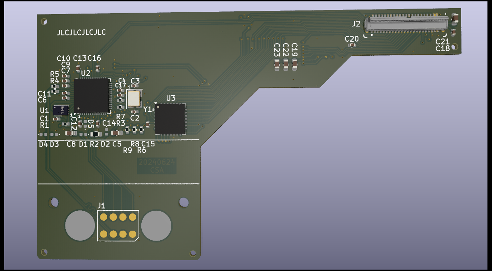

# Input Module for Thinkpad X1 Carbon Gen 10 keyboard

This module is based on the "Microcontroller Input Module" example
from https://github.com/FrameworkComputer/InputModules which in turn
is based on the Adafruit Feather RP2040 (https://www.adafruit.com/product/4884).

More discussion of this project, and of replacement keyboards for
the Framework 16 laptop generally, can be found in the [Framework
forums](https://community.frame.work/t/thinkpad-keyboard-mod-super-early-stages/38484/58).

## License
Input Modules © 2023 by Framework Computer Inc is licensed under CC BY 4.0.

This module for the Thinkpad X1 Carbon Gen 10 keyboard is © 2024 by
C. Scott Ananian and is also licensed under CC BY 4.0.

To view a copy of this license,
visit http://creativecommons.org/licenses/by/4.0/

## Fabrication and Assembly
A 0.8mm PCB is recommended.

All components are SMT on the bottom side of the board.

To enter boot mode on the RP2040 to reflash, hold down the "Fn" key on
the keyboard as power is applied.

## BOM
You can find alternatives for just about each of these components
except for the microcontroller.  The keyboard FPC is designed to be inserted
with contacts facing down toward the PCB, which is "up" (since the connector
is on the bottom side of the board) and thus will require folding the
keyboard's FPC cable to achieve the proper orientation.

Notes: 1uF caps are 2.2uF in pico reference design and it had one more 100nF cap on 1v1;
match crystal caps to crystal selected.

| Item # | Designator                                         | Qty | Manufacturer                        | Mfg Part #               | Description / Value | Package/Footprint                                    | Type |
|--------|----------------------------------------------------|-----|-------------------------------------|--------------------------|---------------------|------------------------------------------------------|------|
| 1      | C1, C4, C6, C9, C11, C12, C13, C14, C15, C16, C17, C18, C20 | 13  | Samsung                    | CL05B104KO5NNNC          | 100nF               | Capacitor_SMD:C_0402_1005Metric                      | SMT  |
| 2      | C2, C3                                             | 2   | Murata                              | GRM1555C1H150JA01D       | 15pF                | Capacitor_SMD:C_0402_1005Metric                      | SMT  |
| 3      | C5, C8, C19, C21, C22, C23                         | 6   | TDK                                 | C1608X5R1A106M080AC      | 10uF                | Capacitor_SMD:C_0603_1608Metric                      | SMT  |
| 4      | C7, C10                                            | 2   | Samsung                             | CL05A105KO5NNNC          | 1uF                 | Capacitor_SMD:C_0402_1005Metric                      | SMT  |
| 5      | D1, D2, D3, D4, D5                                 | 5   | Littelfuse                          | SP0402B-ULC-01ETG        | D_TVS               | Diode_SMD:D_0402_1005Metric                          | SMT  |
| 6      | H1, H2                                             | 2   | Keystone                            | 24929                    | 24929               | InputModule:MountingHole_3.7mm_Pad_24929             | SMT  |
| 7      | J2                                                 | 1   | HDGC                                | 0.3K-HX-45PWB            | 45-pin FPC connector | 20655-045E-01:0.3K-HX-45PWB                         | SMT  |
| 8      | R1, R3                                             | 2   | Yageo                               | RC0402FR-071KL           | 1k                  | Resistor_SMD:R_0402_1005Metric                       | SMT  |
| 9      | R2                                                 | 1   | Yageo                               | RC0402FR-07330KL         | 330k                | Resistor_SMD:R_0402_1005Metric                       | SMT  |
| 10     | R4, R5                                             | 2   | Panasonic                           | ERJ-2RKF27R0X            | 27                  | Resistor_SMD:R_0402_1005Metric                       | SMT  |
| 11     | R6, R7, R8, R9                                     | 4   | Panasonic                           | ERJ-2RKF1000X            | 100                 | Resistor_SMD:R_0402_1005Metric                       | SMT  |
| 12     | U1                                                 | 1   | Winbond                             | W25Q16JVUXIQ             | W25Q16JVUXIQ        | InputModule:SON-8-1EP_3x2mm_P0.5mm_EP0.2x1.6mm       | SMT  |
| 13     | U2                                                 | 1   | Raspberry Pi                        | RP2040TR7                | RP2040              | Package_DFN_QFN:QFN-56-1EP_7x7mm_P0.4mm_EP3.2x3.2mm  | SMT  |
| 14     | U3                                                 | 1   | Microchip                           | MCP23S17_ML              | MCP23S17_ML         | Package_DFN_QFN:QFN-28-1EP_6x6mm_P0.65mm_EP4.25x4.25mm | SMT|
| 15     | Y1                                                 | 1   | Abracon                             | ABM8G-12.000MHZ-18-D2Y-T | 12.000MHz           | Crystal:Crystal_SMD_3225-4Pin_3.2x2.5mm              | SMT  |
